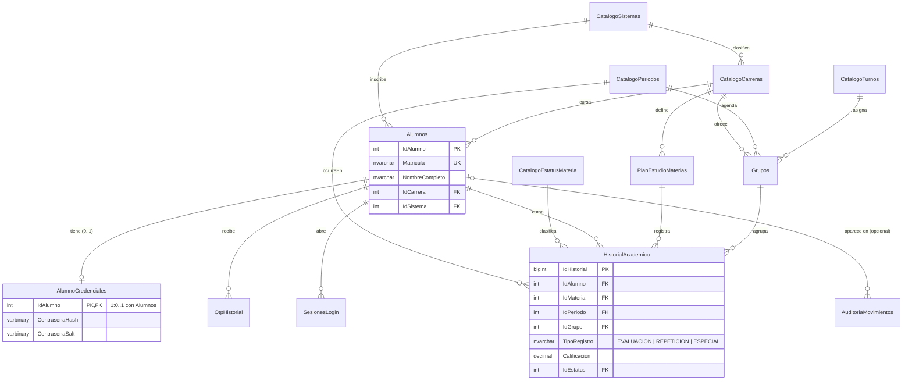

# Base de Datos — AppTESCHI (esquema V2, normalizado)

- **Motor:** SQL Server Express
- **Base de datos:** `AppTeschiDB`
- **Relacionado con:** [[MAPA_PROYECTO]], [[2FA_Login]], [[DECISIONES_TECNICAS]] (DEC-014)
- **Backend que la consume:** `07_BACKEND/AppTeschi.Api/server.js`

---

## Por qué se rediseñó (esquema V1 → V2)

El esquema original (V1) tenía dos problemas de diseño que se confirmaron con datos reales de la propia base de desarrollo:

1. **Identidad duplicada.** `Usuarios` (perfil sincronizado desde el SIIA) y `CuentasRegistro` (alta local con contraseña) representaban al **mismo alumno** en dos tablas sin ninguna relación entre sí. Se comprobó en producción: la matrícula `20240001` tenía **nombres distintos** en cada tabla — nada impedía que un mismo alumno terminara con dos historiales inconsistentes.
2. **Dependencias transitivas (viola 3FN).** `OtpHistorial` y `SesionesLogin` repetían la columna `Matricula` a pesar de ya tener `IdUsuario` — la matrícula se puede obtener siempre por JOIN, no hace falta copiarla.
3. **Mismo dato en dos formatos.** `Usuarios.Carrera` era texto libre (`'Ingenieria en Sistemas'`) mientras `CuentasRegistro.IdCarrera` ya usaba el catálogo — dos representaciones distintas del mismo concepto, sin forma de garantizar que coincidieran.
4. **Grupo de columnas repetido (viola 1FN).** El Kardex oficial repite 3 veces "Calificación + Periodo" (Evaluación / Curso Repetición / Curso Especial) como columnas. Copiado tal cual a una tabla sería un grupo repetido clásico — casi siempre vacío.

Ver [[DECISIONES_TECNICAS]] → **DEC-014** para la decisión completa.

---

## Diagrama entidad-relación (V2)



---

## Tablas

### Identidad

#### `Alumnos` — reemplaza a `Usuarios` + `CuentasRegistro`
Un único registro por persona, sin importar si llegó por registro local, por sincronización del SIIA, o por ambos caminos.

| Columna | Tipo | Notas |
|---|---|---|
| `IdAlumno` | INT IDENTITY | PK |
| `Matricula` | NVARCHAR(20) | UNIQUE |
| `NombreCompleto` | NVARCHAR(200) | **Un solo campo**, no 3 (ver nota abajo) |
| `CorreoInstitucional` | NVARCHAR(255) | UNIQUE *parcial* (solo cuando no es NULL) |
| `IdSistema`, `IdCarrera` | INT | FK a los catálogos |
| `Equivalencias`, `Activo` | BIT | |
| `IntentosFallidosOtp`, `BloqueadoHasta` | | Antifuerza bruta del OTP |

> **¿Por qué `NombreCompleto` es un solo campo y no `Nombres`/`ApellidoPaterno`/`ApellidoMaterno`?**
> El SIIA y el resto de la app (`UserSession.nombreCompleto` en Kotlin) siempre manejan el nombre como una sola cadena. Solo el formulario de registro local pedía los 3 campos por separado, y el propio backend los volvía a concatenar en cada consulta (`server.js` v1: `` `${Nombres} ${ApellidoPaterno} ${ApellidoMaterno}` ``). Separar un dato que el resto del sistema jamás vuelve a separar es complejidad sin beneficio — se concatena una sola vez, al registrar.

#### `AlumnoCredenciales` — contraseña local (cardinalidad 1 a 0..1)
No todo alumno tiene contraseña local — la mayoría entra validando contra el SIIA y nunca la registra. Separarla evita una columna casi siempre `NULL` en `Alumnos` y aísla el dato más sensible en su propia tabla.

`IdAlumno` es **a la vez PK y FK** hacia `Alumnos` (clave primaria compartida) — así la cardinalidad 1:0..1 queda garantizada por el propio diseño, sin necesitar una columna `IdCredencial` aparte ni una validación aplicativa.

### Catálogos

| Tabla | Para qué sirve |
|---|---|
| `CatalogoSistemas` | Escolarizado / Abierto / Dual |
| `CatalogoCarreras` | Las 9 carreras del TESCHI (con `IdSistema`) |
| `CatalogoPeriodos` | `Anio` + `Numero` (1 o 2) → `Etiqueta` calculada ("2026-2") — una sola fuente para cualquier periodo, en vez de texto libre repetido |
| `CatalogoEstatusMateria` | `AP` / `PC` / `NA` — mismos códigos del Kardex oficial |
| `CatalogoTurnos` | Matutino / Vespertino |

### Auditoría y acceso

| Tabla | Cambio respecto a V1 |
|---|---|
| `OtpHistorial` | Ya no repite `Matricula` (solo `IdAlumno`); `CodigoHash` pasó de `NVARCHAR(128)` a `CHAR(64)` (un SHA-256 en hex siempre mide exactamente 64 caracteres) |
| `SesionesLogin` | Igual: solo `IdAlumno`, sin `Matricula` redundante |
| `AuditoriaMovimientos` | Conserva `ActorMatricula`/`ActorNombre` como **snapshot de texto a propósito** (una bitácora debe reflejar el nombre tal como era en ese momento, no el actual) + se agregó `IdAlumno` **nullable** solo para poder hacer JOIN cuando se conoce al alumno |

### Dominio académico (nuevo — reemplaza los datos hardcodeados en Kotlin)

| Tabla | Reemplaza en la app |
|---|---|
| `PlanEstudioMaterias` | `PlanDeEstudiosIsc.kt` (53 materias de ISC + 48 de Animación Digital y Efectos Visuales, ya sembradas — mismo esquema para ambas carreras, sin ningún cambio de tabla) |
| `Grupos` | `GruposIsc.kt` (20 grupos reales, ya sembrados) — `Semestre`/`Turno`/`Numero` son columnas propias, **no** se derivan con una expresión regular sobre la clave como hace `GruposIsc.turno()` en Kotlin |
| `HistorialAcademico` | `HistorialAcademico.kt` — Kardex, Tira de Materias y Calificaciones son, cada uno, un filtro distinto sobre esta misma tabla (igual que `materiasPara(...)` del lado de la app: una sola fuente) |

`HistorialAcademico.TipoRegistro` (`EVALUACION` / `REPETICION` / `ESPECIAL`) es la versión **normalizada** de los 3 grupos de columnas "Calificación + Periodo" que repite el PDF oficial del Kardex: en vez de 6 columnas casi siempre vacías, cada intento de una materia es una fila.

> **Actualizado en DEC-017:** `HistorialAcademico` ya se lee/escribe en producción, pero solo desde el lado del **administrador** (`GET`/`PUT /api/calificaciones/...`, pantalla `AdminCalificacionesScreen`) — captura/edita la calificación de cualquier alumno. El módulo "Calificaciones" del **alumno** (`CalificacionesViewModel.kt`) sigue siendo un *mock* local en Kotlin, independiente de esta tabla; falta conectarlo para que un alumno vea sus propias calificaciones reales. `PlanEstudioMaterias`/`Grupos` siguen sin endpoints de escritura (se siembran manualmente vía los scripts SQL).

### Vista de conveniencia

`dbo.vw_HistorialAcademico` — une Alumno + Materia + Periodo + Grupo + Estatus en una sola consulta, ejemplo:

```sql
SELECT * FROM dbo.vw_HistorialAcademico WHERE Matricula = '2099000001' ORDER BY Semestre;
```

---

## Tablas retiradas (respaldo, no se borraron)

`Usuarios` y `CuentasRegistro` se **renombraron** a `_ObsoletoV1_Usuarios` y `_ObsoletoV1_CuentasRegistro` en vez de borrarse — quedan como respaldo de solo lectura hasta confirmar que todo funciona con el esquema nuevo. Se pueden eliminar manualmente más adelante.

---

## Bug encontrado y corregido durante la migración

Los nombres de `CatalogoCarreras` estaban guardados con los acentos corruptos en esta base de datos (p. ej. "Ingeniería" como "Ingeniería") — probablemente por haberse ejecutado alguna vez `01_CrearBaseDatos.sql` con una herramienta que no leyó el archivo como UTF-8. Esto afectaba silenciosamente el nombre de carrera que ve el alumno en el dropdown de registro. Se corrigió el dato y el script de migración ahora lo detecta y corrige automáticamente si vuelve a pasar (Sección 2.5 de `03_MigracionV2_Normalizacion.sql`).

---

## Ubicación de los scripts

| Archivo | Descripción |
|---|---|
| `AppTeschi/database/sql/01_CrearBaseDatos.sql` | Esquema V1 original (histórico) |
| `AppTeschi/database/sql/03_MigracionV2_Normalizacion.sql` | **Migración V1 → V2** — crea `Alumnos`, migra datos, crea el dominio académico |
| `AppTeschi/database/sql/02_ProcedimientosUsuarios.sql` | SPs actualizados al esquema V2 (`sp_UpsertAlumno`, `sp_RegistrarOtp`, `sp_VerificarOtp`, `sp_IniciarSesion`) — ninguno lo usa el backend hoy, son opcionales |
| `AppTeschi/database/sql/04_SeedMateriasAnimacion.sql` | Plan de estudios real de Ingeniería en Animación Digital y Efectos Visuales (48 materias, 235 créditos) |
| `AppTeschi/database/sql/05_SeedGruposAnimacion.sql` | 21 grupos reales de Animación (fuente: "Horarios Animacion.pdf" 2026-2) — clave real del SIIA para esta carrera es **`ADYEV`**, no `ANIMACION` |
| `AppTeschi/database/sql/06_SeedGruposIndustrial.sql` | 16 grupos reales de Ingeniería Industrial (fuente: "Horarios_Industrial.pdf" 2026-2) — clave real del SIIA es **`II`**; único caso con grupos de 9° semestre (`9II21`, `9II22`), a diferencia de ISC/Animación |
| `AppTeschi/database/sql/07_SeedMateriasIndustrial.sql` | Plan de estudios de Ingeniería Industrial — **parcial** (47 de 53 materias, 212 créditos), fuente: mapa curricular oficial TecNM IIND-2010-227. Faltan 6 materias de 8°/9° semestre cuyo crédito no se pudo leer con confianza en la imagen (ver detalle abajo) |
| `AppTeschi/database/sql/08_SeedMateriasMecatronica.sql` | Plan de estudios completo de Ingeniería Mecatrónica (52 materias, 260 créditos — suma exacta contra el total institucional oficial) |
| `AppTeschi/database/sql/09_SeedGruposMecatronica.sql` | 14 grupos reales de Mecatrónica (fuente: "Horario Mecatronica grupos 26-2.pdf" 2026-2) — clave real del SIIA es **`IM`**; también tiene grupo de 9° semestre (`9IM21`) |
| `AppTeschi/database/sql/10_SeedMateriasQuimica.sql` | Plan de estudios completo de Ingeniería Química (52 materias, 260 créditos — cada valor viene de la tabla oficial "CLAVE/ASIGNATURA/HORAS" impresa en cada horario de grupo, no de la retícula; suma exacta contra el total institucional) |
| `AppTeschi/database/sql/11_SeedGruposQuimica.sql` | 13 grupos reales de Química (fuente: "Horarios Quimica.pdf" 2026-2, PDF escaneado) — clave real del SIIA es **`IQ`** |
| `AppTeschi/database/sql/12_SeedMateriasAdministracion.sql` | Plan de estudios completo de Licenciatura en Administración (54 materias, 260 créditos — cada semestre coincide exactamente con el total de créditos por columna de la retícula oficial LADM-2010-234) |
| `AppTeschi/database/sql/13_SeedGruposAdministracion.sql` | 26 grupos reales de Administración (fuente: "HORARIOS Administracion 2026-2.pdf") — clave real del SIIA es **`LA`**; la carrera con más grupos de 9° semestre encontrada (`9LA21`, `9LA22`, `9LA23`) |
| `AppTeschi/database/sql/14_SeedMateriasGastronomia.sql` | Plan de estudios completo de Licenciatura en Gastronomía (53 materias, 260 créditos) — se agregó "Servicio Social" (10 créditos) que no venía en la lista del alumno pero sí en la retícula oficial, para llegar al total institucional correcto |
| `AppTeschi/database/sql/15_SeedGruposGastronomia.sql` | 28 grupos reales de Gastronomía (fuente: "HORARIOS DE GRUPOS GASTRONOMIA 2026-2.pdf") — clave real del SIIA es **`LG`**; la carrera con más grupos totales encontrada hasta ahora |
| `AppTeschi/database/sql/16_AgregarSemestreAlumnos.sql` | Agrega `Alumnos.Semestre` (nullable, 1-12) — lo asigna el administrador; junto con `IdCarrera` permite calcular la carga académica esperada de un alumno (ver DEC-016) |
| `AppTeschi/database/sql/17_TablaAdministradores.sql` | `Administradores` + `AdministradorCredenciales` — cuentas reales de administrador, separadas de `Alumnos` (ver DEC-019) |
| `AppTeschi/database/sql/18_OtpHistorialParaAdministradores.sql` | `OtpHistorial.IdAlumno` pasa a nullable, se agrega `IdAdministrador` nullable + `CHECK` "exactamente uno de los dos", y `Intentos TINYINT` (ver DEC-019) |
| `04_BASE_DATOS/sql/` (bóveda) | Copia de respaldo de los mismos 18 scripts |

### Orden de ejecución en una base nueva

```
01 → 03 → 02 → 04 → 05 → 06 → 07 → 08 → 09 → 10 → 11 → 12 → 13 → 14 → 15 → 16 → 17 → 18
```

### Pendiente: 6 materias de Ingeniería Industrial sin créditos confirmados

El mapa curricular oficial (IIND-2010-227) no se pudo leer con suficiente confianza en la esquina de 8°/9° semestre para estas materias — se dejaron fuera del seed en vez de inventar un valor:

| Semestre | Materia |
|---|---|
| 8 | Productividad Humana |
| 8 | Temas Selectos de Ingeniería Industrial |
| 8 | Medición y mejoramiento de la Productividad |
| 8 | Gestión de los Sistemas de Calidad Aplicados |
| 9 | Productividad Aplicada |
| 9 | Ingeniería de Calidad |

Cuando se confirmen sus créditos, agregarlas con un `INSERT` adicional a `PlanEstudioMaterias` (mismo patrón que `07_SeedMateriasIndustrial.sql`).

> ⚠️ Ejecutar con `sqlcmd -f 65001` (o SSMS con codificación UTF-8) para evitar el bug de acentos descrito arriba.

### Estado de despliegue

| Parámetro | Valor |
|---|---|
| **Servidor** | `VICTUS` (SQL Server local) |
| **Base de datos** | `AppTeschiDB` ✅ Migrada a V2 el 08/09/2026 |
| **Alumnos migrados** | 15 (9 de `Usuarios` + 7 de `CuentasRegistro`, 1 matrícula duplicada entre ambas se fusionó en un solo registro) |
| **Con contraseña local** | 7 |
| **Materias sembradas** | 53 ISC + 48 Animación + 47/53 Industrial (parcial) + 52 Mecatrónica + 52 Química + 54 Administración + 53 Gastronomía — todas a 260 créditos salvo Animación (235cr) e Industrial (212cr, parcial) |
| **Grupos sembrados** | 20 ISC + 21 Animación + 16 Industrial + 14 Mecatrónica + 13 Química + 26 Administración + 28 Gastronomía (todos reales, ciclo 2026-2) |

---

## Integración con la app y el backend

```
App Android → API REST (server.js) → SQL Server Express (Alumnos, AlumnoCredenciales, ...)
```

Endpoints de `server.js` actualizados al esquema V2 (mismo contrato JSON hacia la app, sin cambios en Kotlin):

| Endpoint | Qué hace ahora |
|---|---|
| `POST /api/registro` | Si la matrícula ya existe como perfil sincronizado del SIIA (sin contraseña), completa ese mismo registro en vez de crear uno nuevo — antes creaba una fila separada e inconsistente |
| `POST /api/auth/cuenta` | Valida contra `Alumnos` + `AlumnoCredenciales` (alumnos únicamente) |
| `POST /api/auth/administrador` | **Nuevo** (DEC-019) — valida contra `Administradores` + `AdministradorCredenciales`, devuelve `rol` |
| `POST /api/otp/enviar`, `POST /api/otp/verificar` | (DEC-019) — generan/verifican el código en `OtpHistorial`; `tipo: "ALUMNO"\|"ADMINISTRADOR"` decide contra cuál tabla resuelve el identificador. Al verificar un administrador, emite el JWT de sesión (DEC-020) |
| `GET/POST/PUT /api/administradores[/:usuario]` | **Nuevos** (DEC-020) — SUPERADMIN-only, listar/crear/editar cuentas de administrador; requieren `Authorization: Bearer <token>` |
| `POST /api/usuarios/sync` | Hace upsert en `Alumnos` (antes: tabla `Usuarios` separada) — mapea la carrera de texto libre del SIIA al catálogo automáticamente |
| `GET /api/usuarios` | Lee de `Alumnos` (alias `IdUsuario`/`Carrera` en el JSON para no romper `AdminUsersService.kt`); ahora incluye `ClaveCarrera` y `Semestre` |
| `PUT /api/usuarios/:matricula/semestre` | (DEC-016) — admin-only, asigna el semestre de un alumno (1-12), deja auditoría |
| `POST /api/usuarios` | **Nuevo** (DEC-017) — admin-only, alta de alumno sin contraseña (la crea el propio alumno al registrarse) |
| `PUT /api/usuarios/:matricula` | **Nuevo** (DEC-017) — admin-only, edición parcial de perfil (solo los campos presentes en el body) |
| `DELETE /api/usuarios/:matricula` | **Nuevo** (DEC-017) — admin-only, baja real en transacción: limpia `HistorialAcademico`/`OtpHistorial`/`SesionesLogin`, desvincula `AuditoriaMovimientos.IdAlumno`, borra `Alumnos` (`AlumnoCredenciales` se va sola por `ON DELETE CASCADE`) |
| `GET /api/plan-estudios/:clave`, `GET /api/grupos/:clave` | (DEC-015) — públicos, catálogo curricular de una carrera |
| `GET /api/calificaciones/:matricula` | **Nuevo** (DEC-017) — admin-only, materias del plan de estudios del alumno + calificación si existe en `HistorialAcademico` |
| `PUT /api/calificaciones/:matricula/:idMateria` | **Nuevo** (DEC-017) — admin-only, captura/edita una calificación (0-10); deriva el estatus automáticamente si no se manda uno explícito |
| `GET /api/estadisticas` | **Nuevo** (DEC-017) — admin-only, agregados para gráficas: alumnos por carrera/semestre, activos/inactivos, altas de los últimos 6 meses, distribución de calificaciones |
| `GET /api/catalogos/registro` | Sin cambios de esquema |
| `GET /api/auditoria` | (DEC-017) admite `?matricula=` (filtra por actor **o** perfil afectado) y `?limit=`; `writeAudit(...)` ahora sí llena `AuditoriaMovimientos.IdAlumno` |

---

## Procedimientos almacenados (opcionales, no usados por server.js)

| SP | Función |
|---|---|
| `sp_UpsertAlumno` | Crear o actualizar perfil |
| `sp_RegistrarOtp` | Guardar hash del OTP enviado |
| `sp_VerificarOtp` | Validar código ingresado |
| `sp_IniciarSesion` | Registrar sesión con IP/GPS |
