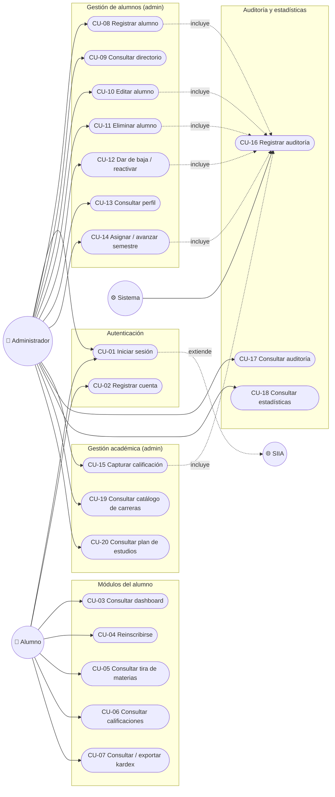

# Casos de Uso — AppTESCHI

> Actores, diagrama de casos de uso y descripción detallada de los flujos más relevantes.
> **Relacionado con:** [[01_Requerimientos_Funcionales]], [[03_Matriz_Trazabilidad]], [[03_Diagramas_Secuencia]]

---

## Actores

| Actor | Descripción |
|---|---|
| **Alumno** | Estudiante inscrito en TESCHI, consume la app desde su celular |
| **Administrador** | Personal de control escolar, con control total sobre alumnos, calificaciones y auditoría |
| **Sistema** | Procesos automáticos del backend (auditoría, envío de OTP, validación de reglas) — actor secundario, no interactivo |
| **SIIA** | Sistema institucional externo, actor externo consultado por scraping |

## Diagrama de casos de uso

---

## Descripción detallada de casos de uso críticos

### CU-01 — Iniciar sesión

- **Actor principal:** Alumno / Administrador
- **Actor secundario:** SIIA (externo), Sistema (envío de OTP)
- **Precondiciones:** El usuario tiene una matrícula registrada (localmente o en el SIIA) o es el administrador de desarrollo.
- **Flujo principal:**
  1. El usuario captura matrícula y contraseña.
  2. El sistema intenta validar en cascada: (a) bypass de administrador local, (b) usuarios de prueba (solo builds debug), (c) cuenta propia contra `AlumnoCredenciales`, (d) SIIA por scraping.
  3. Si alguna fuente acepta las credenciales y no es el bypass de administrador, el sistema pide un correo de contacto y envía un código OTP de 6 dígitos.
  4. El usuario captura el código; el sistema lo valida contra el generado en memoria (vigencia 10 minutos).
  5. El sistema crea la sesión (`UserSession`) y navega al dashboard según el rol.
- **Flujos alternativos:**
  - 2a. Ninguna fuente acepta las credenciales → se muestra "Usuario o contraseña incorrectos" y se registra un evento de auditoría local de tipo "Acceso rechazado".
  - 4a. Código incorrecto → contador de intentos fallidos; si se alcanza el umbral configurado, se bloquea el intento.
  - 4b. Código expirado (>10 min) → se exige reenviar.
- **Postcondiciones:** Sesión activa con matrícula, nombre y rol establecidos.

### CU-08 — Registrar alumno (administrador)

- **Actor principal:** Administrador
- **Precondiciones:** El administrador tiene sesión activa; conoce la matrícula, nombre y carrera del alumno.
- **Flujo principal:**
  1. El administrador abre "Alumnos" → "Registrar alumno" y captura matrícula, nombre completo, carrera (del catálogo), correo(s) y, opcionalmente, semestre.
  2. El sistema valida que la matrícula no exista y que la carrera exista en el catálogo.
  3. El sistema inserta el alumno en `Alumnos` (sin credenciales — el propio alumno las crea después al registrarse).
  4. El sistema registra el movimiento en auditoría, enlazado al nuevo alumno.
  5. El directorio se refresca mostrando el alumno nuevo.
- **Flujos alternativos:**
  - 2a. Matrícula duplicada → error 409, no se crea el registro.
  - 2b. Carrera inexistente en el catálogo → error 400.
- **Postcondiciones:** Nuevo registro en `Alumnos`; un nuevo evento en `AuditoriaMovimientos`.

### CU-11 — Eliminar alumno (administrador)

- **Actor principal:** Administrador
- **Precondiciones:** El alumno existe en el directorio.
- **Flujo principal:**
  1. El administrador presiona "Eliminar" sobre un alumno y confirma en el diálogo de advertencia.
  2. El sistema abre una transacción: desvincula al alumno de su historial de auditoría (pone `IdAlumno = NULL`, conservando el texto de los movimientos), borra su historial académico, OTP, sesiones y, por cascada de base de datos, sus credenciales.
  3. El sistema borra el registro de `Alumnos` y confirma la transacción.
  4. El sistema registra un evento de auditoría "Alumno eliminado" (sin enlace a `IdAlumno`, porque ya no existe).
- **Flujos alternativos:**
  - 2a. Cualquier paso de la transacción falla → `rollback` completo, no queda el alumno a medio borrar.
  - 1a. Matrícula inexistente → error 404.
- **Postcondiciones:** El alumno y todo su historial académico desaparecen de forma permanente; su rastro de auditoría previo se conserva sin vínculo.

### CU-14 — Asignar / avanzar semestre (administrador)

- **Actor principal:** Administrador
- **Precondiciones:** El alumno existe.
- **Flujo principal:**
  1. El administrador abre el perfil del alumno y ve la tarjeta de semestre.
  2. Si el alumno no tiene semestre asignado, el sistema ofrece las opciones 1 a 12.
  3. Si el alumno ya tiene un semestre asignado, el sistema **solo** ofrece semestres superiores al actual.
  4. El administrador elige un semestre; el sistema lo guarda y refresca el historial de materias.
- **Flujos alternativos:**
  - 3a. El administrador (o un cliente externo a la app) intenta fijar un semestre igual o menor al actual → el servidor rechaza la solicitud con error 400, independientemente de si la app lo habría permitido.
  - 3b. El alumno ya está en el semestre máximo (12) → no se ofrece ninguna opción.
- **Postcondiciones:** `Alumnos.Semestre` actualizado; evento de auditoría "Semestre actualizado".

### CU-15 — Capturar calificación (administrador)

- **Actor principal:** Administrador
- **Precondiciones:** El alumno tiene una carrera asignada (para poder resolver su plan de estudios).
- **Flujo principal:**
  1. El administrador elige un alumno desde "Calificaciones".
  2. El sistema muestra todas las materias del plan de estudios de su carrera, agrupadas por semestre, con la calificación existente si la hay.
  3. El administrador captura o edita una calificación (0-10) para una materia y confirma.
  4. El sistema calcula el estatus (Aprobada ≥ 6, No aprobó < 6, Por cursar si se deja vacía) si no se especifica uno explícito, y guarda (inserta o actualiza) la fila en `HistorialAcademico`.
  5. El sistema registra el movimiento en auditoría.
- **Flujos alternativos:**
  - 3a. Calificación fuera de 0-10 → error 400, no se guarda.
- **Postcondiciones:** Fila nueva o actualizada en `HistorialAcademico`; evento de auditoría "Calificación actualizada".

### CU-16 / CU-17 — Registrar y consultar auditoría

- **Actor principal (CU-16):** Sistema (se dispara automáticamente dentro de cada endpoint administrativo, no es una acción que el usuario invoque directamente)
- **Actor principal (CU-17):** Administrador
- **Flujo principal (CU-16):** cada endpoint que modifica datos (alta, edición, baja, eliminación, calificación, semestre, sincronización) llama a `writeAudit(actor, accion, detalle, matriculaAfectada)`, que resuelve el `IdAlumno` del afectado por subconsulta y guarda un renglón inmutable con fecha, actor y detalle.
- **Flujo principal (CU-17):** el administrador abre "Auditoría", opcionalmente filtra por matrícula (busca coincidencia como actor **o** como perfil afectado) y consulta los movimientos más recientes.
- **Postcondiciones:** Ninguna acción administrativa relevante queda sin rastro.

---

## Resumen de casos de uso restantes

| CU | Resumen | Complejidad |
|---|---|---|
| CU-02 | Registrar cuenta propia con contraseña; completa un perfil existente si ya fue sincronizado desde el SIIA | Media |
| CU-03 | Ver tarjetas de módulos disponibles en el dashboard del alumno | Baja |
| CU-04 | Elegir periodo/grupo y enviar solicitud de reinscripción (mock) | Media |
| CU-05 | Ver materias pendientes del semestre actual (mock) | Baja |
| CU-06 | Ver calificaciones y promedio del semestre actual (mock) | Baja |
| CU-07 | Ver kardex completo y exportarlo a PDF (cálculo real sobre datos mock) | Media |
| CU-09 | Buscar/filtrar el directorio completo de alumnos | Baja |
| CU-10 | Editar campos individuales de un alumno sin afectar los demás | Baja |
| CU-12 | Alternar `Activo` de un alumno con confirmación | Baja |
| CU-13 | Ver información consolidada de un alumno (perfil + historial + auditoría) | Media |
| CU-18 | Ver gráficas agregadas de matrícula y calificaciones | Baja |
| CU-19 | Listar carreras del catálogo institucional | Baja |
| CU-20 | Ver materias y grupos reales de una carrera | Baja |
