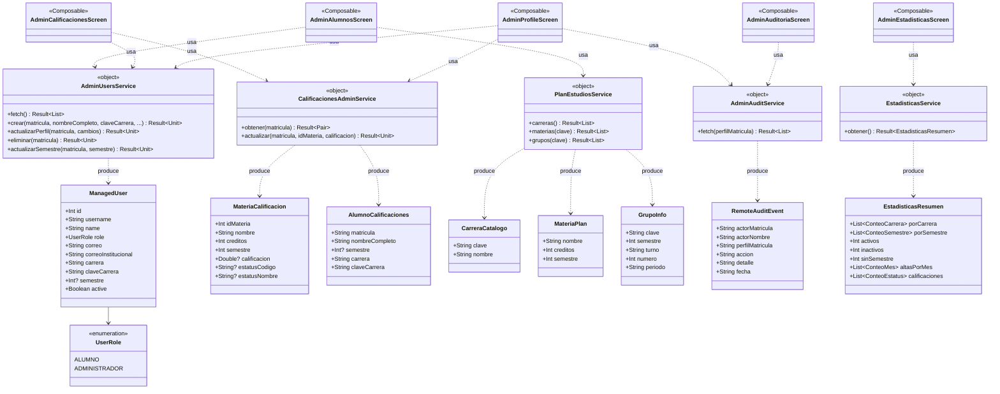
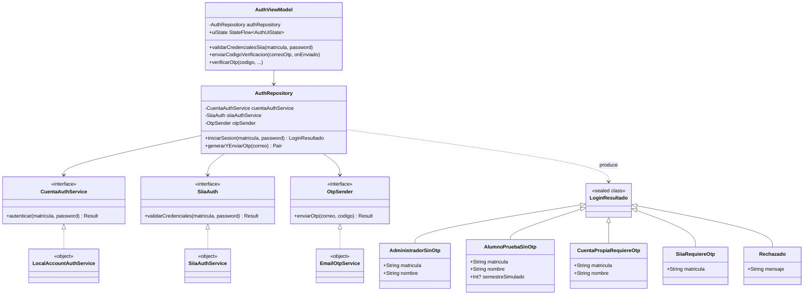

# Diagrama de Clases — AppTESCHI

> Modelo de objetos del lado de la aplicación Android (Kotlin). Complementa el diagrama entidad-relación de [[Base_Datos_Usuarios]], que modela la persistencia; este diagrama modela cómo la app representa y mueve esos datos en memoria.
> **Relacionado con:** [[Base_Datos_Usuarios]], [[04_Diagrama_Componentes]]

---

## Dominio de administración (alumnos, calificaciones, auditoría, estadísticas)

> Todos los `*Service` son `object` de Kotlin (singleton), implementados sobre `OkHttpClient` + `org.json`, sin capa de mapeo adicional — el JSON se parsea directo a estas data classes.

---

## Dominio de autenticación (estrategia en cascada)

> `CuentaAuthService`, `SiiaAuth` y `OtpSender` son interfaces (patrón *Strategy*) inyectadas por constructor en `AuthRepository` — permite sustituir cada fuente por un *fake* en pruebas unitarias (`AuthViewModelTest`) sin tocar red real.
