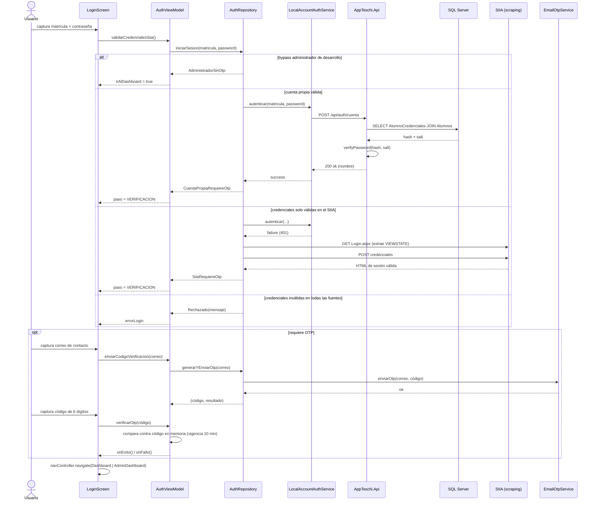
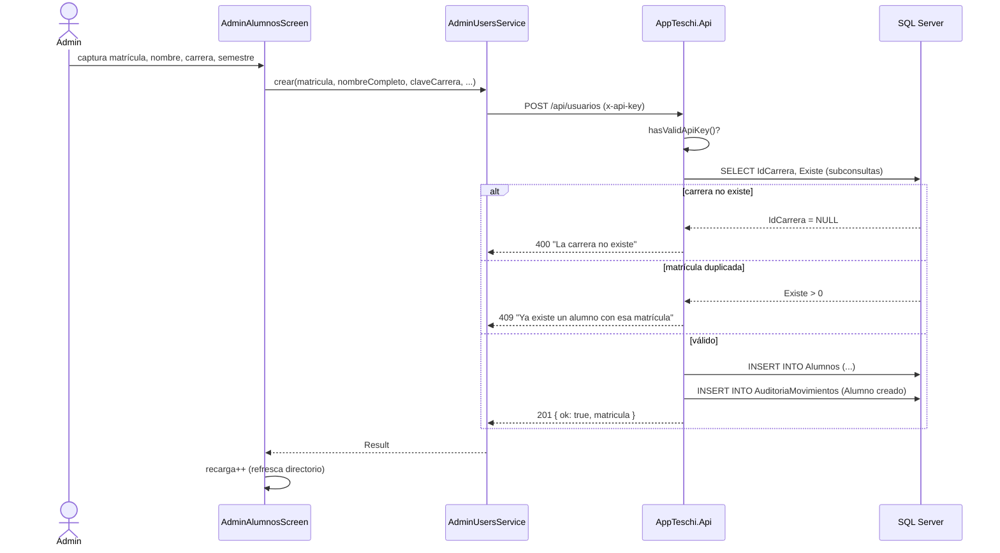
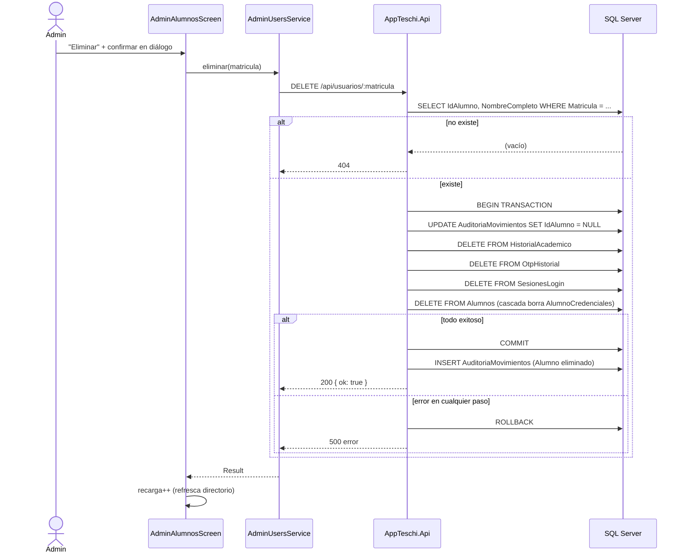
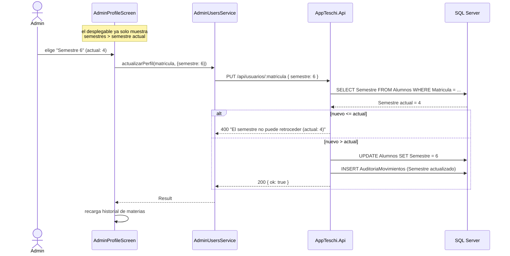
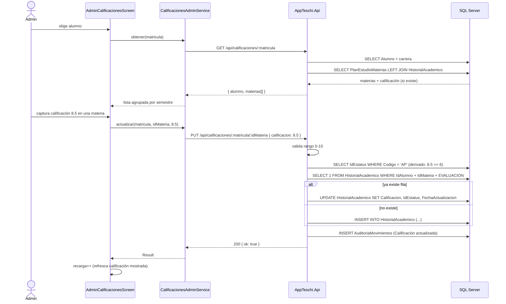

# Diagramas de Secuencia — AppTESCHI

> Interacción temporal entre componentes para los flujos más críticos del sistema.
> **Relacionado con:** [[01_Casos_de_Uso]], [[04_Diagrama_Componentes]]

---

## 1. Iniciar sesión (cascada de autenticación + OTP) — CU-01

---

## 2. Registrar alumno (administrador) — CU-08

---

## 3. Eliminar alumno (transacción con limpieza en cascada) — CU-11

---

## 4. Avanzar semestre (regla "nunca retrocede") — CU-14

---

## 5. Capturar calificación — CU-15

