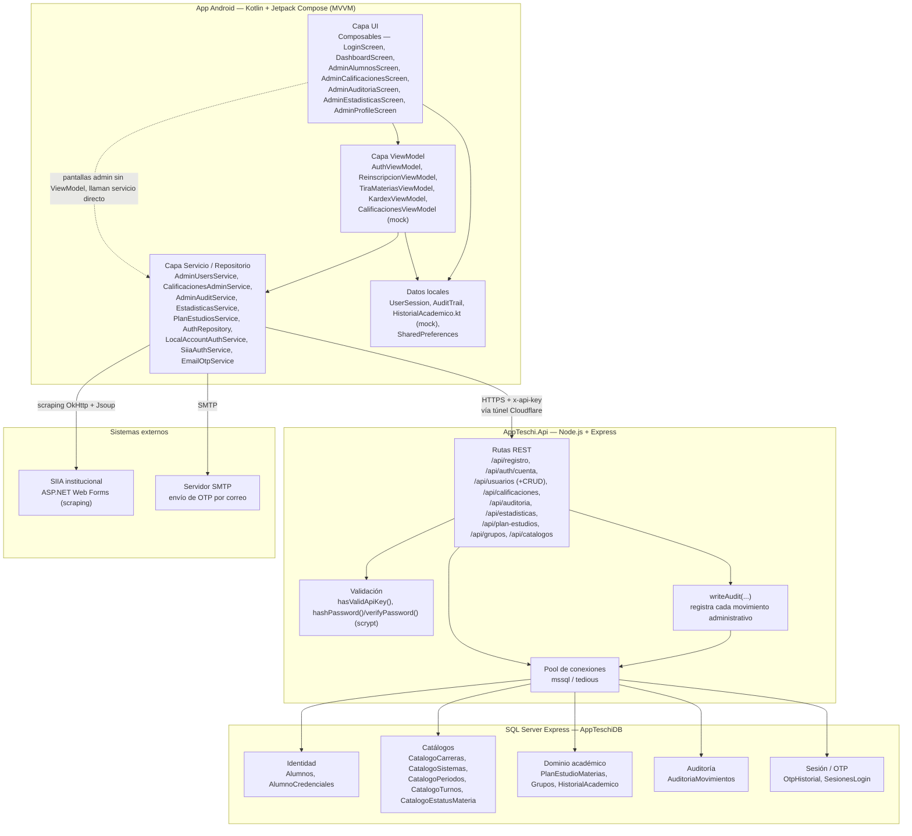

# Diagrama de Componentes — AppTESCHI

> Cómo se dividen las responsabilidades dentro de cada aplicación y cómo se comunican entre sí.
> **Relacionado con:** [[05_Diagrama_Despliegue]], [[03_Diagramas_Secuencia]], [[REGLAS_PROYECTO]]

## Responsabilidades por componente

| Componente | Responsabilidad | No hace |
|---|---|---|
| Capa UI (Composables) | Renderizar estado, capturar entrada del usuario | No contiene lógica de negocio ni llamadas HTTP directas |
| Capa ViewModel | Orquestar estado de UI (`StateFlow`), invocar servicios, exponer resultado | No conoce detalles de HTTP/SQL; depende de interfaces inyectables |
| Capa Servicio (Android) | Construir requests HTTP, serializar/deserializar JSON, mapear a *data classes* | No decide reglas de negocio (las valida el backend) |
| Rutas REST (backend) | Validar entrada, aplicar reglas de negocio, orquestar consultas SQL | No conoce nada de Compose/Android |
| `writeAudit` | Registrar cada movimiento administrativo de forma consistente | No decide qué acciones auditar (cada ruta lo invoca explícitamente) |
| SQL Server | Persistir y garantizar integridad referencial (FKs, `CHECK`, transacciones) | No contiene lógica de aplicación (solo un par de vistas de conveniencia) |
