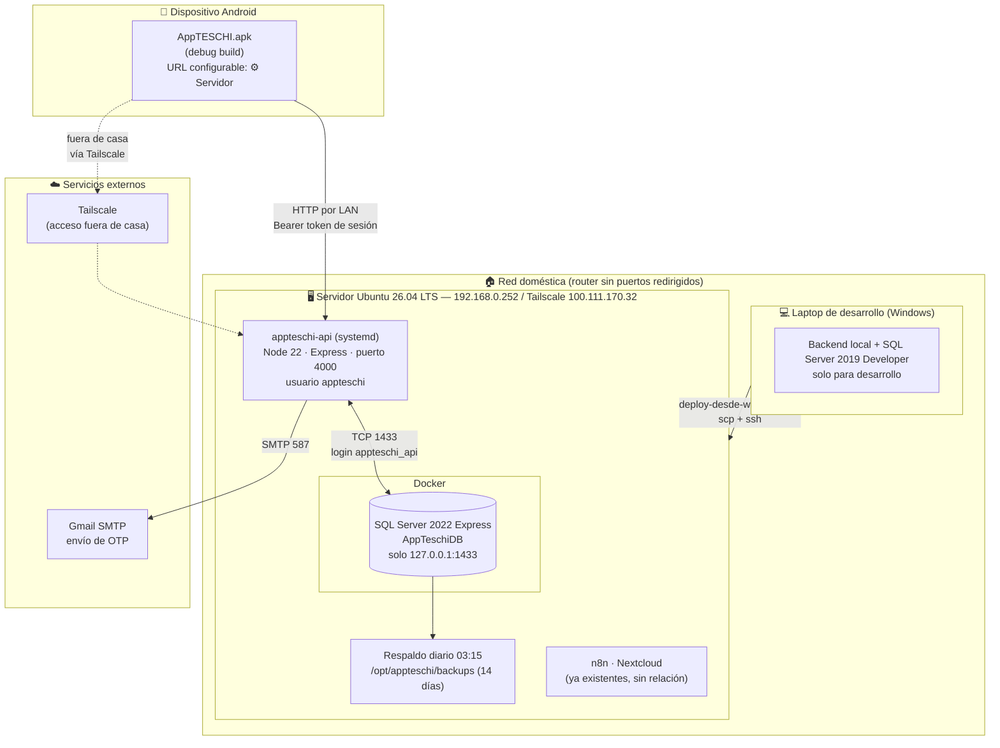

# Diagrama de Despliegue — AppTESCHI

> Topología física actual (actualizada 19/09/2026, DEC-031): el backend y la base de datos corren en un **servidor Ubuntu en casa**, accesible solo por LAN y Tailscale. La laptop es entorno de desarrollo. Aún no hay despliegue institucional ni acceso público — ver [[03_Manual_Tecnico_Instalacion]] §8.
> **Relacionado con:** [[04_Diagrama_Componentes]], [[03_Manual_Tecnico_Instalacion]], [[DECISIONES_TECNICAS]]

## Notas de la topología actual

- **No hay acceso desde internet.** El router no redirige puertos: solo se llega al puerto 4000 desde la LAN (`192.168.0.x`) o desde la red Tailscale (teléfono con la app de Tailscale). `ufw` está inactivo a propósito (DEC-031).
- **SQL Server no sale del servidor:** el contenedor publica `127.0.0.1:1433`, nadie más lo ve. La API usa el login `appteschi_api` (`db_owner` solo en `AppTeschiDB`), no `sa`.
- **SQL Server va en Docker** porque Microsoft solo documenta soporte nativo hasta Ubuntu 24.04.
- **El teléfono nunca toca SQL Server:** todo pasa por la API. Ya no existe ninguna comunicación con el SIIA (DEC-026).
- **Autenticación:** contraseña → ticket de 10 min → OTP por correo → token de sesión propio (alumno o administrador). Ya no hay `x-api-key` (DEC-030).
- **Despliegue:** desde la laptop con `deploy-desde-windows.ps1` (sube el código y reinicia el servicio). La laptop conserva su propia base local para desarrollo; **no está sincronizada** con la del servidor.
- Los respaldos viven en el mismo disco que la base: falta una copia fuera del servidor.

## Camino a producción (no implementado todavía)

| Elemento actual | Reemplazo esperado |
|---|---|
| Acceso solo por LAN / Tailscale | Dominio propio + Cloudflare Tunnel con nombre (`https://api.<dominio>`), API escuchando solo en `127.0.0.1` con `HOST` y `TRUST_CLOUDFLARE` |
| HTTP dentro de la red privada | HTTPS terminado por Cloudflare |
| Respaldos en el mismo servidor | Copia automática a otro equipo (Tailscale) |
| `.env` con credenciales en el servidor (modo 600, solo `appteschi`) | Gestor de secretos, si el alcance crece |
| `POST /api/registro` público | Prueba de identidad adicional (ver DEC-030) antes de abrir a internet |
| APK debug | APK/AAB firmado con keystore de producción |
