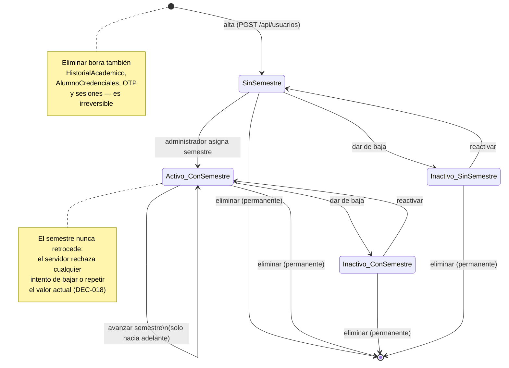
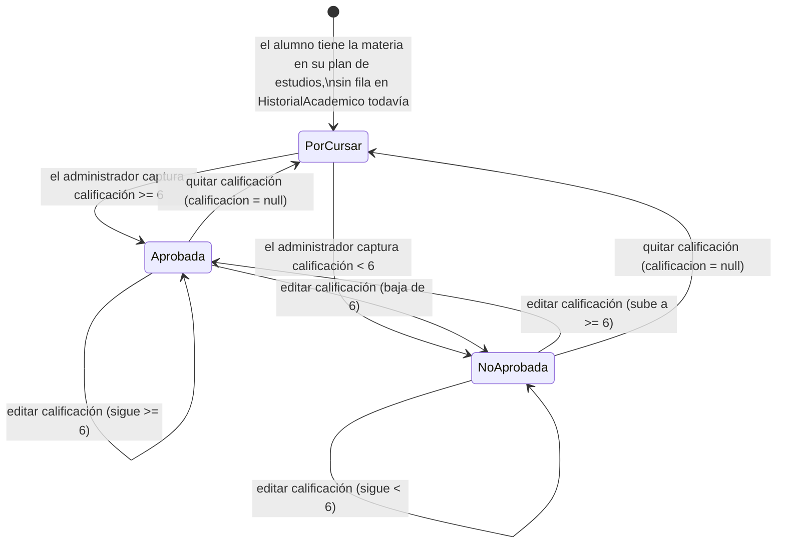
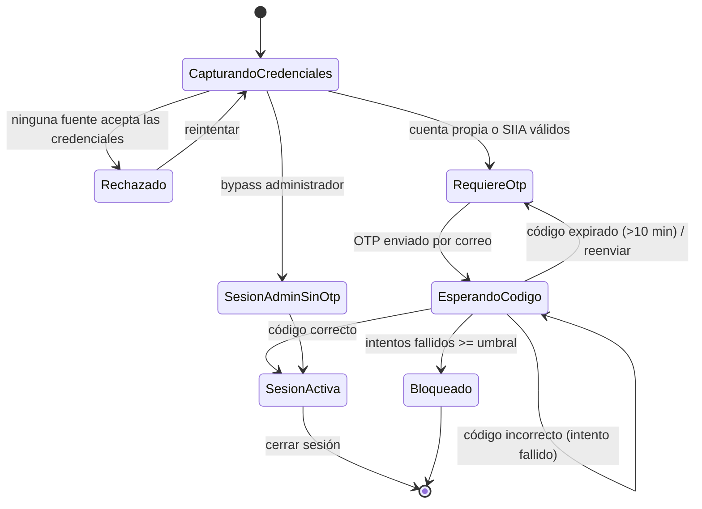
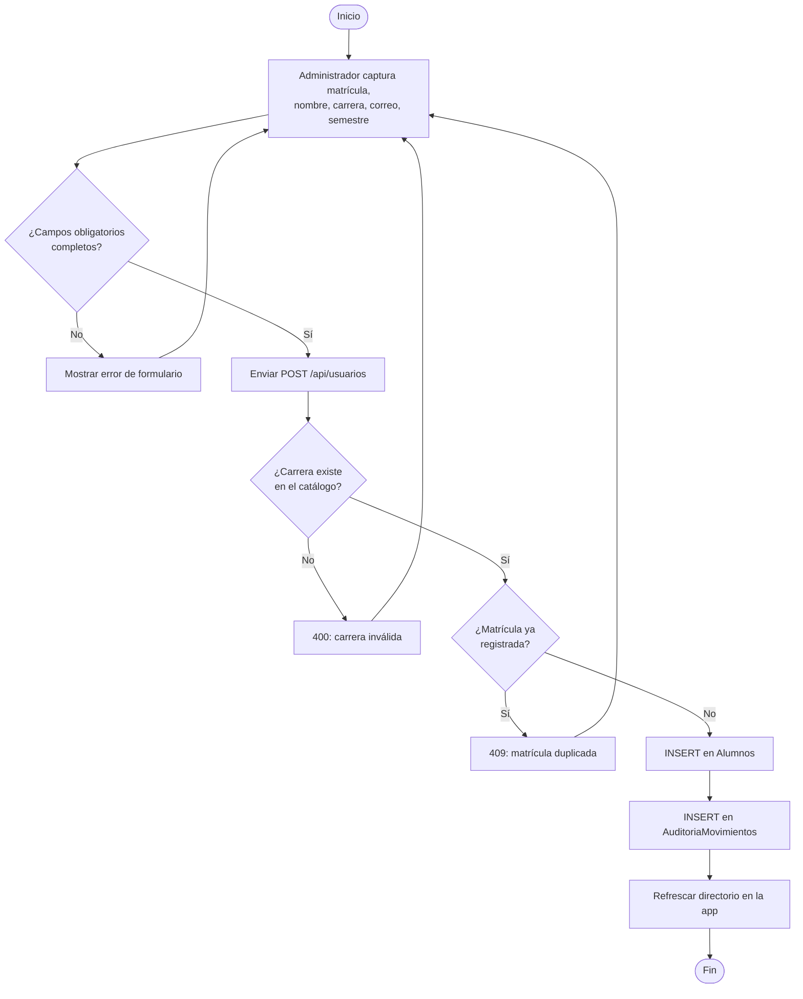
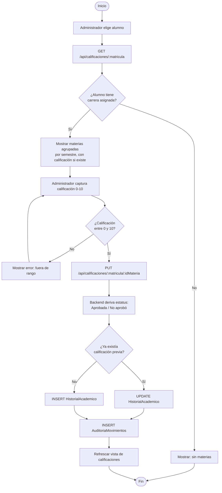

# Diagramas de Estados y de Actividades — AppTESCHI

> Ciclo de vida de las entidades clave y flujo paso a paso de los procesos más relevantes.
> **Relacionado con:** [[01_Casos_de_Uso]], [[03_Diagramas_Secuencia]]

---

## Diagramas de estados

### Ciclo de vida de un alumno (`Alumnos.Activo` + `Alumnos.Semestre`)

### Ciclo de vida de una materia cursada (`HistorialAcademico`)

### Ciclo de vida de una sesión de inicio de sesión

---

## Diagramas de actividades

### Alta de alumno por el administrador

### Captura de calificación por el administrador

